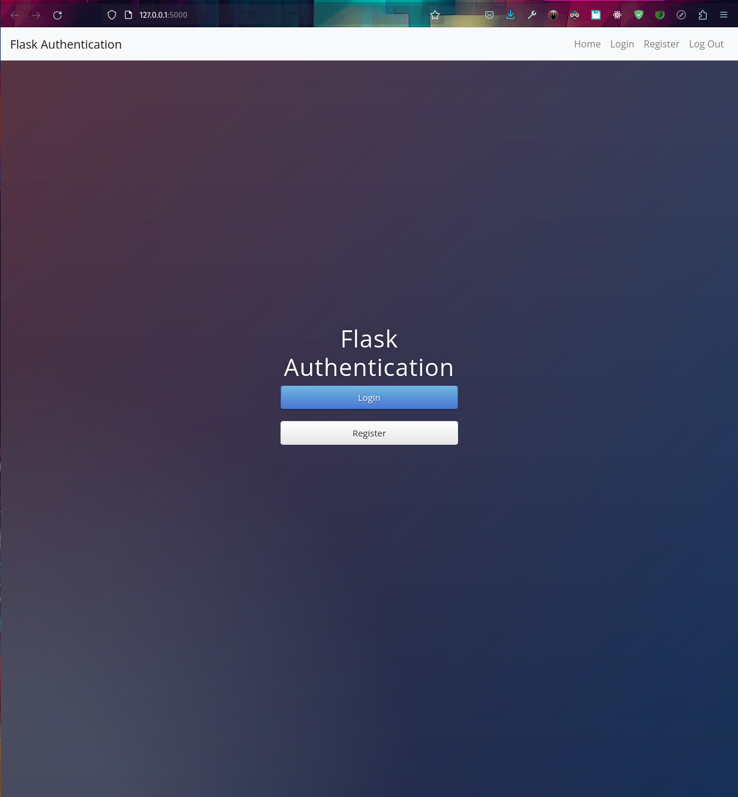

# Flask Authentication App

A simple Flask application demonstrating user authentication using Flask-Login and Flask-SQLAlchemy.

## Features

- User registration
- User login
- Password hashing for security
- Protected routes that require authentication
- User session management

## Setup & Installation

### Prerequisites

- Python 3
- Pipenv

### Installation Steps

1. Clone the repository:

```bash
git clone https://github.com/j-breedlove/authenticate_with_flask.git 
```

2. Change directory to the cloned repository:

```bash
cd authenticate_with_flask
```

3. Install dependencies using pipenv:

```bash
pipenv install
```

4. Activate the pipenv shell:

```bash
pipenv shell
```

5. Run the application:

```bash
python app.py
```

Now, the application should be running at `http://127.0.0.1:5000/`.

## Usage

- Visit the home page to view the welcome message.
- Register a new user by navigating to `/register`.
- Login with a registered user at `/login`.
- Access protected content at `/secrets` once logged in.
- Logout from the session using the `/logout` route.
- Download sample files from the `/download` route.

## Contributing

Pull requests are welcome. For major changes, please open an issue first to discuss what you would like to change.

## License

[MIT](https://choosealicense.com/licenses/mit/)
